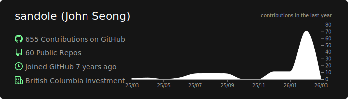
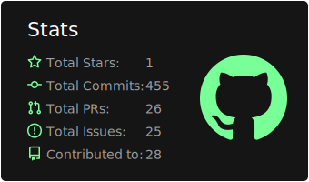
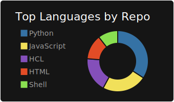

# Hello 👋
**Software Engineer** · Building AI-powered investment tooling in Private Markets.

## What I'm Working On
- AI/ML integration for private equity workflows
- Cloud-native architectures on Azure (Kubernetes, microservices, event-driven systems)
- MS in AI @ University of Ottawa

<table>
  <tr>
    <td colspan="2">
      
    </td>
  </tr>
  <tr>
    <td>
      
    </td>
    <td>
      
    </td>
  </tr>
</table>

---
## Open Source Contributions

<!-- CONTRIBUTIONS:START -->
<table>
  <tr>
    <td>
      <a href="https://github.com/python/cpython"><strong>python/cpython</strong></a> 
      The Python programming language  
       
      
        
        
        
      
    </td>
    <td>
      <a href="https://github.com/OpenBB-finance/OpenBB"><strong>OpenBB-finance/OpenBB</strong></a> 
      Financial data platform for analysts, quants and AI agents.  
        
      
        
        
        
      
    </td>
  </tr>
  <tr>
    <td>
      <a href="https://github.com/run-llama/llama_index"><strong>run-llama/llama_index</strong></a> 
      LlamaIndex is the leading framework for building LLM-powered agents over your data.  
       
      
        
        
        
      
    </td>
    <td></td>
  </tr>
</table>
<!-- CONTRIBUTIONS:END -->

---
## Tech Stack
**Languages**

**Cloud & Infrastructure**

**AI/ML & Data**

**Frameworks**

---
## Get in Touch

